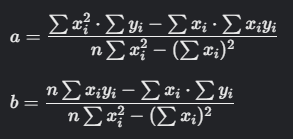

<h3>DESCRIPTION:</h3>

<b>Background:</b>

    

A linear regression line has an equation in the form <code>Y = a + bX</code>, where <code>X</code> is the explanatory
variable and <code>Y</code>  is the dependent variable. The parameter <code>b</code>  represents the <i>slope</i> of 
the line, while <code>a</code> is called the <i>intercept</i> (the value of <code>y</code> when <code>x = 0</code>).

For more details visit the related <a href="http://en.wikipedia.org/wiki/Simple_linear_regression">wikipedia page.</a>

<b>Task:</b>
The function that you have to write accepts two list/array, <code>x</code> and <code>y</code>, representing 
the coordinates of the points to regress (so that, for example, the first point has coordinates 
(<code>x[0], y[0]</code>)).

Your function should return a tuple (in Python) or an array (any other language) of two elements: <code>a</code>
(intercept) and <code>b</code> (slope) in this order.

You must round your result to the first 4 decimal digits

<b>Formula:</b>

<code>xi</code> and <code>yi</code> is <i>x</i> and <i>y</i> co-ordinate of <i>i</i>-th point;  
<i>n</i> is length of input.

    

<b>Examples:</b>

<pre>
<code>regressionLine([25,30,35,40,45,50], [78,70,65,58,48,42]) == (114.381, -1.4457)</code>
<code>regressionLine([56,42,72,36,63,47,55,49,38,42,68,60], [147,125,160,118,149,128,150,145,115,140,152,155]) == (80.7777, 1.138)</code>
</pre>